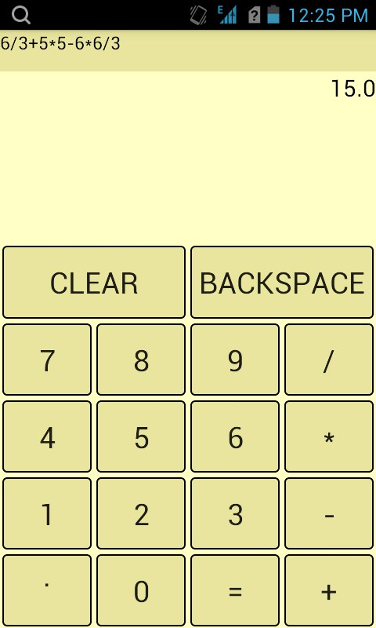

# RPNCalculator
## Задание
* Сделать калькулятор на 4 действия (+,-,*,/) с функциями Backspace и Clear.
* Сделать так, чтобы он помнил последнее число после выключения.
* Поддержать поворот экрана (портретный и ландшафтный режим).
* В портретном и ландшафтном режиме расположить кнопки оптимальным образом так, чтобы не пропадало место и ничего не вылезало за границы экрана
* ! Калькулятор должен работать как нормальный калькулятор (как бы банально это ни звучало).
## Описание 
 Данный калькулятор работает на ОПЗ. 
 [Класс для перевода и работы с ОПЗ.](app/src/main/java/com/kleshchin/danil/basiccalculator/RPNConverter.java)
 ## Screenshots
 
 
 
